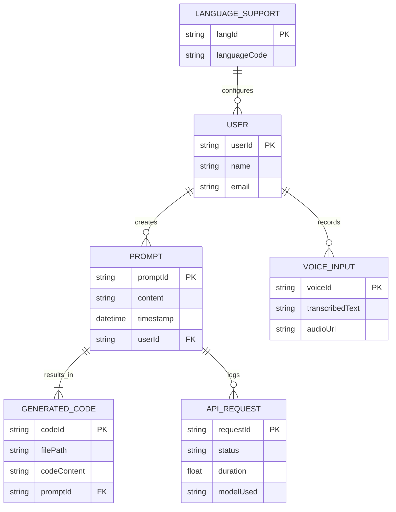
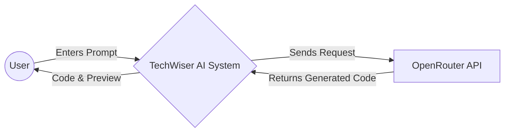
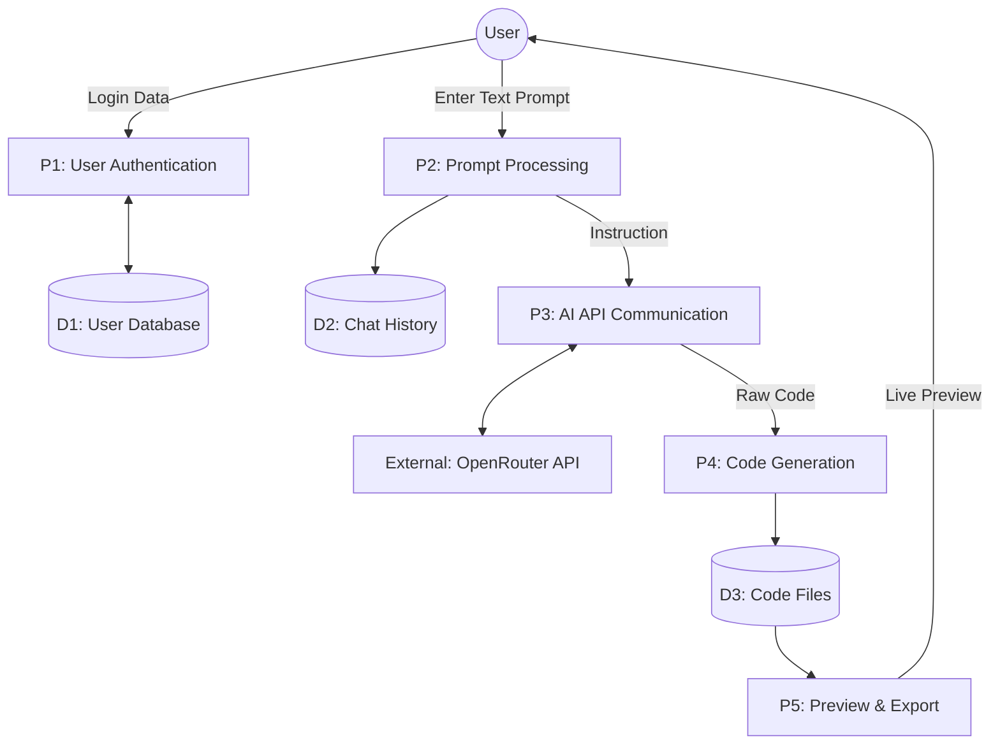

# PROJECT SYNOPSIS
## Project Title: TechWiser – AI Website & App Builder

---

### 1. Introduction
In the contemporary digital era, establishing a web presence has transitioned from a luxury to an absolute necessity for businesses, professionals, and hobbyists alike. However, the traditional lifecycle of web development involves significant hurdles, including high costs, the need for specialized programming knowledge (HTML, CSS, JavaScript), and considerable time investments. While content management systems (CMS) like WordPress and Wix have simplified this process, they still require a learning curve and manual design effort.

**TechWiser** is an innovative solution that leverages Artificial Intelligence to bridge the gap between human creativity and technical execution. By utilizing Large Language Models (LLMs) via the OpenRouter API, TechWiser allows users to describe their vision in plain natural language. The system then autonomously generates high-quality, responsive code and provides an instant live preview. This project aims to democratize web development, making it accessible to anyone with an idea, regardless of their technical background.

### 2. Problem Statement
Despite the proliferation of "No-Code" tools, several problems persist in the web development ecosystem:
- **Complexity of Design**: Users often struggle with drag-and-drop interfaces, which can be overwhelming and time-consuming.
- **Cost Barriers**: Professional web development services are expensive, and many high-end AI builders require monthly subscriptions.
- **Technical Knowledge Gap**: Non-technical users cannot easily modify source code or understand the underlying logic of their websites.
- **Slow Prototyping**: Generating a MVP (Minimum Viable Product) manually takes days or weeks, delaying the feedback loop for entrepreneurs.

TechWiser addresses these issues by providing a completely free, prompt-based generation system that produces production-ready code in minutes.

### 3. Literature Review
The shift towards AI-driven code generation has seen significant milestones:
- **Wix & Squarespace**: Traditional leaders in the space, recently incorporating AI for layout suggestions, but still primarily manual.
- **V0.dev (by Vercel)**: A state-of-the-art tool that generates React components from prompts. However, it is geared towards developers and often requires a paid tier for extensive use.
- **GitHub Copilot**: An AI pair programmer that assists developers but is not a standalone "builder" for end-users.
- **OpenRouter API**: A unified interface for multiple LLMs. By using OpenRouter’s free tier models (like DeepSeek or Mistral), TechWiser provides a cost-effective alternative to proprietary builders while offering comparable generation capabilities.

Research indicates that users prefer conversational interfaces over complex toolbars, justifying the AI-centric approach of TechWiser.

### 4. Scope of Project
The scope of TechWiser includes:
- **Natural Language Parsing**: Converting user intent into structured instructions for AI.
- **Multi-File Generation**: Creating organized project structures including `App.js`, `index.css`, and various components.
- **Real-time Preview Engine**: Utilizing Sandpack to render the generated code instantly in the browser.
- **Responsive Design**: Ensuring all generated outputs are mobile-friendly and modern.
- **Iterative Refinement**: Allowing users to chat with the AI to modify or add features to the existing code.

The project is initially targeted at portfolio sites, landing pages, and small-scale web applications.

### 5. Objectives
- To design a user-friendly interface for AI-driven web development.
- To implement a robust communication layer between the frontend and OpenRouter API.
- To develop a "Phased Generation" logic that handles project planning and file creation separately to ensure high accuracy.
- To provide a "Free-to-Use" model by leveraging open-source and free-tier AI APIs.
- To enable instant live previews without requiring local development environments.

### 6. System Architecture Explanation
TechWiser follows a modern **Full-Stack Web Architecture**:
- **Frontend Layer**: Built with **Next.js**, providing a fast, SEO-friendly user interface. **Tailwind CSS** is used for the "Lovable" aesthetic UI.
- **AI Orchestration**: A specialized API route in Next.js handles the logic of sending prompts to OpenRouter, receiving streaming responses, and parsing JSON code blocks.
- **Database & Backend**: **Convex** serves as the backend-as-a-service, managing user workspaces, chat history, and generated code storage in real-time.
- **Code Execution**: **Sandpack (by CodeSandbox)** is integrated to provide an isolated, browser-based environment for compiling and running React/Vite code.

### 7. Modules Description
1. **Authentication Module**: Manages user login and profile persistence using Clerk or Convex Auth.
2. **Prompt Analysis Module**: Cleans and optimizes user prompts before sending them to the LLM.
3. **AI Generation Module**: Manages the "Phased" workflow—first creating a file plan, then generating individual files sequentially to avoid API timeouts.
4. **Workspace Module**: A split-pane view showing the chat interface on the left and the code/live preview on the right.
5. **Preview & Export Module**: Renders the final product and provides options to copy code or download as a ZIP (future).

### 8. Working Methodology
TechWiser uses the **Agile Development Model**. The core workflow is:
1. **Requirement Analysis**: Identifying core features based on common user needs.
2. **System Design**: Mapping the flow from user prompt to live website.
3. **Phased Generation (Core Logic)**:
    - *Phase 1 (Planning)*: The AI reviews the prompt and decides what files are needed (e.g., `Header.jsx`, `Pricing.jsx`).
    - *Phase 2 (Content)*: The AI writes the code for each planned file.
    - *Phase 3 (Assembly)*: The system feeds these files into the Sandpack preview engine.
4. **Testing**: Manual verification of generated code quality across different categories (Portfolio, E-commerce, Blog).

### 9. Hardware Requirements
- **Processor**: Intel Core i3 or equivalent (Minimum); i5 or higher (Recommended).
- **RAM**: 8 GB RAM (Minimum) to handle multiple Chrome tabs and build processes.
- **Storage**: 256 GB SSD (Recommended for fast OS and IDE operations).
- **GPU**: Integrated graphics are sufficient for web development.
- **Connectivity**: Stable internet connection (Mandatory for API calls).

### 10. Software Requirements
- **Operating System**: Windows 10/11, macOS, or Linux.
- **Development Environment**: Node.js (v18 or higher).
- **Frameworks**: Next.js 14/15, Tailwind CSS.
- **Backend/Database**: Convex.
- **Code Editor**: VS Code (Recommended).
- **Browser**: Google Chrome or Firefox (Latest versions for modern CSS support).

### 11. Advantages
- **Zero Cost**: Completely free to use, making it ideal for students and startups.
- **High Speed**: Reduces web development time from days to minutes.
- **No Coding Required**: Enables non-developers to create functional web apps.
- **Iterative Power**: Refine components through natural conversation rather than manual editing.
- **Modern Stack**: Generates clean React/Tailwind code ready for scalability.

### 12. Disadvantages
- **OpenRouter Latency**: Free APIs often have slower response times compared to paid models like GPT-4o.
- **Internet Dependence**: Cannot function offline as it requires the AI server connection.
- **API Rate Limits**: Frequent usage might trigger rate limiting on the free API tier.
- **Complexity Limits**: While great for frontends, complex backend logic still requires manual refinement.

### 13. Future Enhancements
- **Voice-to-Code**: Integration of Web Speech API for hands-free website building.
- **Multi-language UI**: Localizing the dashboard for regional users (Hindi, Marathi, etc.).
- **One-Click Deploy**: Directly publishing the generated site to platforms like Vercel or Netlify.
- **Image Generation**: Integrating DALL-E or Stable Diffusion to generate custom assets within the UI.

### 14. Conclusion
TechWiser represents a significant step forward in the democratization of the web. By combining the power of Next.js with state-of-the-art AI models, the project demonstrates that high-quality web development no longer requires a degree in Computer Science. While challenges like API latency exist, the ability to turn a simple sentence into a fully functional, responsive web application is a powerful tool for the future of digital creation.

---

# ========================
# ER DIAGRAM
# ========================

### 1. Textual Explanation
- **User**: The primary actor. Attributes: `userId` (PK), `name`, `email`, `createdAt`.
- **Prompt**: The command entered by the user. Attributes: `promptId` (PK), `content`, `timestamp`, `userId` (FK).
- **GeneratedCode**: The output from the AI. Attributes: `codeId` (PK), `filePath`, `codeContent`, `promptId` (FK).
- **APIRequest**: Records the transaction with OpenRouter. Attributes: `requestId` (PK), `status` (Success/Fail), `duration`, `modelUsed`, `promptId` (FK).
- **LanguageSupport**: Stores localizations for the UI. Attributes: `langId` (PK), `languageCode` (en, hi, mr), `translationData`.
- **VoiceInput**: Future entity for storing audio transcription logs. Attributes: `voiceId` (PK), `audioFileUrl`, `transcribedText`, `userId` (FK).

### 2. ASCII Diagram Representation
```text
+----------------+       1       M       +----------------+
|      USER      |-----------------------|     PROMPT     |
+----------------+                       +----------------+
| - userId (PK)  |                               |
| - name         |                               | 1
| - email        |                               |
+----------------+                               | M
                                         +----------------+
                                         | GENERATED CODE |
                                         +----------------+
                                         | - codeId (PK)  |
                                         | - filePath     |
                                         | - codeContent  |
                                         | - promptId(FK) |
                                         +----------------+
         1       M       +----------------+
PROMPT ------------------|  API_REQUEST   |
                         +----------------+
                         | - requestId(PK)|
                         | - status       |
                         | - duration     |
                         | - promptId(FK) |
                         +----------------+
```

### 3. Mermaid ER Diagram


---

# ========================
# DFD (DATA FLOW DIAGRAM)
# ========================

### 1. DFD Level 0 (Context Diagram)
**External Entities**: User, OpenRouter API.
**Process**: TechWiser System (Main).

**ASCII Diagram**:
```text
              [ Prompt Content ]          [ AI Response ]
    (User) ----------------------> (   TechWiser   ) <---------------- (OpenRouter API)
           <---------------------  (     System    ) ----------------->
              [ Live Preview ]             [ Raw Request ]
```

**Mermaid Code**:


### 2. DFD Level 1 (Process Breakdown)

**Processes**:
- P1: User Authentication
- P2: Prompt Processing
- P3: AI API Communication
- P4: Code Generation & Parsing
- P5: Preview Rendering

**Data Stores**:
- D1: User Database
- D2: Chat History
- D3: Code Files

**ASCII Diagram**:
```text
(User) --(Creds)--> [P1: Auth] <----> [D1: User DB]
  |
(User) --(Prompt)--> [P2: Process Prompt] ----> [D2: Chat History]
                         |
                         V
                  [P3: API Communication] <----> (OpenRouter API)
                         |
                         V
                  [P4: Code Generation] ----> [D3: Code Files]
                         |
                         V
                  [P5: Preview Rendering] --(Live Site)--> (User)
```

**Mermaid Code**:

